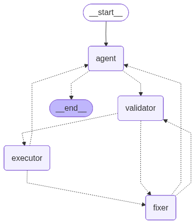

## AIS SQL Agent (LangGraph + Postgres/PostGIS)

This project provides an AI assistant that answers maritime AIS telemetry questions by translating natural-language requests into safe, read-only SQL queries against a PostgreSQL/PostGIS database. It is designed to work specifically with an `ais_data` table containing vessel position reports and related metadata.

At a high level, the assistant:
- Decides whether a question requires database access or can be answered conversationally
- Generates SQL only when needed (targeting the `ais_data` table)
- Validates SQL for unsafe operations before running it
- Executes the query and returns the result
- Retries with an automatic “fix” loop when a query fails
- Summarizes raw query output into a clear, natural-language response

---
## Script: `ais_data_filter.ipynb`

This notebook prepares a reduced, higher-quality AIS dataset from NOAA’s AIS archives (https://coast.noaa.gov/htdata/CMSP/AISDataHandler/2024/index.html). Because the raw AIS files are very large, the workflow focuses on a limited slice (first five days of January 2024), applies quality filters, and then reduces the dataset further by keeping only “high-frequency” vessels (vessels that appear many times in the data).

### Data Source

The raw AIS CSV files are downloaded from NOAA’s AIS data archive (2024). The notebook assumes daily files such as:

- `AIS_2024_01_01.csv`
- `AIS_2024_01_02.csv`
- `AIS_2024_01_03.csv`
- `AIS_2024_01_04.csv`
- `AIS_2024_01_05.csv`

### Phase A: Quality Filtering (Row-Level Cleaning)

The first stage removes unreliable, default, or low-signal telemetry points to keep only meaningful vessel movement data.

Quality filters applied:

- **Valid coordinates**
  - Keeps rows where `LAT` is within ±90 and `LON` is within ±180
  - Explicitly removes AIS error codes like `LAT = 91` and `LON = 181`

- **Moving vessels**
  - Keeps rows where `SOG > 0.5` knots to reduce docked/anchored points and GPS jitter

- **Valid draft**
  - Keeps rows where `Draft > 0` to ensure vessels have configured transponder details

- **Valid heading**
  - Removes rows where `Heading = 511` (AIS “Not Available” sentinel)

These masks are combined into a single `quality_mask`, producing a cleaned dataframe (e.g., `df_clean` / `df_quality`). The notebook prints how many rows were removed and retained after cleaning.

### Phase B: Frequency Analysis (Choosing a Cutoff)

Before committing to a reduction threshold, the notebook computes how many rows and vessels remain at multiple “minimum appearance” cutoffs (counts per `MMSI`). Example cutoffs include:

- `>= 1, 5, 10, 50, 100, 200, 500, 1000`

For each cutoff, it reports:
- Total rows kept (sum of counts for qualifying MMSIs)
- Percent of the cleaned data retained
- Number of unique vessels retained

This is used to select a cutoff that meaningfully reduces size while preserving vessels with enough track history.

### Phase C: Frequency Filtering (Dataset Reduction)

After selecting a threshold (commonly `frequency_cutoff = 1000`), the notebook removes vessels that appear fewer than the cutoff number of rows in the already-cleaned dataset:

- Group by `MMSI`
- Keep only MMSIs whose count is `>= frequency_cutoff`

The output is a smaller dataset consisting of “active” vessels with richer movement history, and it reports:
- Rows removed by frequency cutoff
- Final row count
- Unique MMSIs remaining

### Phase D: Multi-Day Processing & Final Dataset Build

The notebook is designed to be run repeatedly for each day’s raw AIS file (Jan 01 → Jan 05), producing per-day cleaned outputs such as:

- `AIS_2024_01_01_cleaned_HighFreq.csv` (pattern)
- ...
- `AIS_2024_01_05_cleaned_HighFreq.csv`

After generating the cleaned daily outputs, the cleaned subsets can be combined into one “ultimate dataset” covering all five days.

> Note: The notebook content shows the per-day cleaning/reduction steps and describes running the process multiple times by swapping `input_file` / `output_file`. The final merge step can be implemented by concatenating the cleaned daily CSVs into a single dataframe and exporting it.

---

## Script: `upload_to_postgresql.ipynb`

This notebook uploads the final combined AIS dataset into a Supabase-hosted PostgreSQL database with PostGIS enabled, preparing it for spatial and temporal queries from the agent.

What it does:
- Connects to Supabase (PostgreSQL) using a SQLAlchemy engine
- Loads the final combined CSV into a Pandas DataFrame
- Parses the `BaseDateTime` column into a proper timestamp datatype
- Creates a PostGIS-compatible `geometry` column from `LAT`/`LON` as point features (EPSG:4326)
- Renames all columns to lowercase to avoid PostgreSQL case-sensitivity issues (e.g., `MMSI` → `mmsi`)
- Uploads the dataset into the `ais_signals` table, replacing any existing table/data

Implementation notes (as reflected in the script):
- The geometry conversion uses GeoPandas (`GeoDataFrame` + `points_from_xy`)
- The upload uses `to_postgis(...)` with `if_exists="replace"` and chunked inserts (`chunksize=1000`)
- After upload, the script prints the final column list (lowercased) for a quick sanity check

---

## Script: `sql_agent_v8.ipynb` (v1.4)

The end-to-end LangGraph workflow is implemented in `sql_agent_v8.ipynb`. The agent runs as a ReAct-style loop where the **agent node owns synthesis** and iterates through **validate → execute → heal** until it has enough tool evidence to answer.

### 1) Database Connectivity

The notebook loads environment variables and creates a PostgreSQL connection using `langchain_community.utilities.SQLDatabase`.

Key points:
- Connection details are read from environment variables (`DB_USER`, `DB_PASSWORD`, `DB_HOST`, `DB_PORT`, `DB_NAME`)
- The database is scoped to the `ais_data` table via `include_tables=['ais_data']`
- Table info includes a small sample of rows to help the agent reason about the schema

---

### 2) Tool Definition

A single LangChain tool is defined:

- `execute_sql(query: str) -> str`

This tool executes the generated SQL against the database and returns the result (or an error string if execution fails). The agent uses this tool as the only mechanism for database interaction.

---

### 3) State Management

The notebook defines an `AgentState` (`TypedDict`) focused on a message-first ReAct trace:

- `messages`: full conversation trace (Human → AI tool-call → ToolMessage → AI answer)
- `schema_context`: schema/rules provided to the LLM
- `sql_query`: generated SQL (if required)
- `current_tool_call_id`: tool call ID used to bind SQL outputs back into history
- `validation_status`: `VALID` / `INVALID`
- `critique`: validator feedback or DB error details
- `retry_count`: number of fix attempts

> Unlike earlier versions, the agent relies on `messages` as the source of truth (instead of storing `question`, `query_result`, and `final_response` fields).

---

### 4) Schema Context & Translation Rules

A dedicated schema prompt block (`AIS_SCHEMA_INFO`) provides:
- Column definitions for `ais_data`
- Mappings for AIS `status` codes
- Mappings for `vesseltype` codes (including ranges for categories like cargo, tanker, passenger)
- Critical translation rules, including:
  - Converting natural language vessel categories/statuses into numeric filters
  - Excluding `heading = 511` when calculating heading statistics or filtering for valid headings
  - “Current state” deduplication using `DISTINCT ON (mmsi)` + `ORDER BY basedatetime DESC`
- A few-shot set of example questions and expected SQL patterns

This schema context is injected into the agent’s system prompt to reduce hallucinations and enforce consistent query generation.

---

### 5) Node Implementations (ReAct Loop)

The workflow is composed of four nodes:

#### A) Agent (`agent_node`)
- Prunes message history using a **sliding-window trim** before calling the LLM
  - Uses `trim_messages(...)` with:
    - `allow_partial=False` to avoid splitting tool-calls from ToolMessages
    - `start_on="human"` to ensure the window begins with a user message
- Decides whether to respond conversationally or generate a SQL tool call
- Supports multi-query tool usage (can call `execute_sql` multiple times for complex questions)

Outputs:
- If DB needed: sets `sql_query`, `current_tool_call_id`, resets `retry_count`
- If conversational: returns a normal assistant message and ends

#### B) Validator (`validator_node`)
- Reviews the generated SQL for unsafe operations and schema violations
- Rejects queries containing dangerous keywords such as:
  - `DROP`, `DELETE`, `INSERT`, `UPDATE`, `ALTER`
- Rejects hallucinated column names and invalid typing of `status` / `vesseltype`

Outputs:
- `validation_status` and optional `critique`

#### C) Executor (`executor_node`)
- Runs the SQL using the `execute_sql` tool
- On success, returns a `ToolMessage` containing SQL output **bound to the original tool_call_id**
- On DB/tool error, converts failure into `critique` for the fixer

Outputs:
- `ToolMessage` (success) or error `critique`

#### D) Fixer (`fixer_node`)
- Activated when validation fails or execution errors occur
- Forces tool usage (`tool_choice="required"`) to produce corrected SQL
- Retries are capped at 3 attempts; after that, it returns a `ToolMessage` error so the agent can respond naturally

Outputs:
- Updated `sql_query`
- Incremented `retry_count`

---



### 6) Graph Construction & Routing

The notebook uses `langgraph.graph.StateGraph` to define execution flow and conditional routing.

Routing behavior:
- Agent produces a tool call → `validator` → (`executor` or `fixer`)
- Successful execution loops back to the **agent** (ReAct: reason → tool → observe → reason)
- Invalid SQL or execution failure routes to `fixer` and retries validation/execution
- Retries are capped at 3 attempts; persistent failures are surfaced back to the agent via a ToolMessage error

The final compiled app is produced via:

```python
memory = MemorySaver()
app = workflow.compile(checkpointer=memory)
```

---

## Data Model Assumptions

Across the project, the expected data includes:
- AIS telemetry fields such as position, speed, course, heading, vessel identifiers, and vessel attributes
- Sentinel/error values (e.g., `LAT=91`, `LON=181`, `Heading=511`) that must be filtered for higher-quality analysis
- Vessel identifiers (`MMSI`) used both for database querying and frequency-based dataset reduction